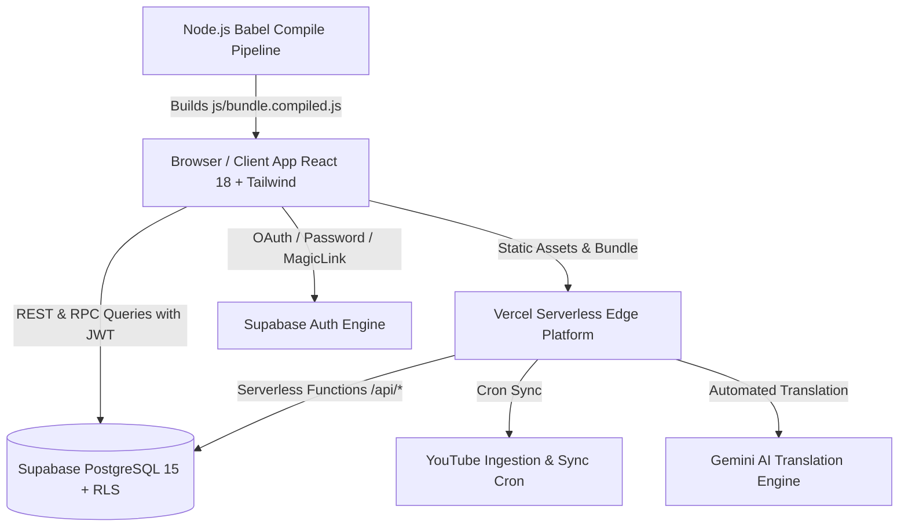
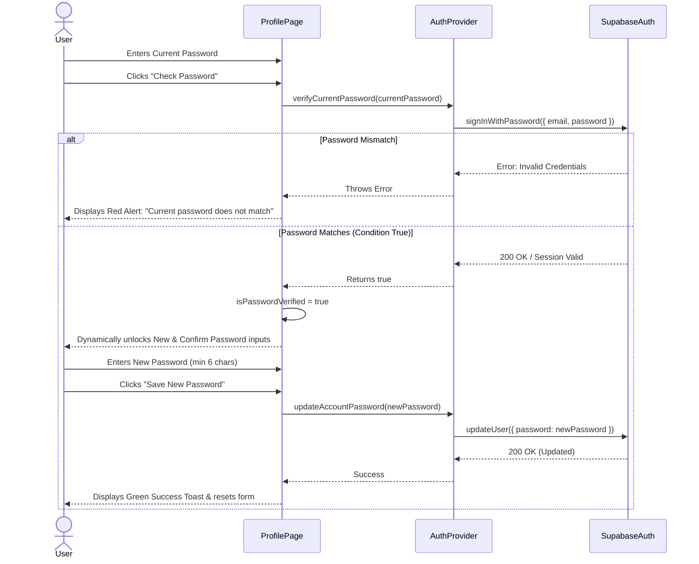

# Muthaleetu Thisai (முதலீட்டு திசை) - Technical Architecture & Developer Documentation

## 1. System Overview & Architecture

**Muthaleetu Thisai** is an enterprise-grade, bilingual (Tamil & English) financial advisory, market intelligence, and investor education platform. It provides high-performance access to 882+ curated video masterclasses, dynamic financial news, mutual fund advisory, investment calculators, and a multi-role Content Management Studio.



---

## 2. Technology Stack

| Layer | Technologies | Purpose |
| :--- | :--- | :--- |
| **Frontend Framework** | React 18.2 (Vanilla UMD + Babel Compiler) | Component lifecycle, interactive state, modals |
| **Styling & Design** | Tailwind CSS 3.4 + Custom Glassmorphism Theme | Responsive dark/light mode, CSS variables, micro-animations |
| **Icons & Media** | Inline SVG + Unsplash CDN + YouTube Embeds | Ultra-lightweight UI, zero layout shift, fast LCP |
| **Authentication** | Supabase Auth (OAuth Google, Email/Password, Magic Link) | JWT session lifecycle, role-based claims |
| **Database** | PostgreSQL 15 via Supabase | Relational data, Row Level Security (RLS), Triggers |
| **API & Serverless** | Vercel Serverless Functions (Node.js 18+) | Backend endpoints under `/api/*` |
| **Build System** | Custom Node.js Babel Compiler (`build-bundle.js`) | Transpiles JSX into production `bundle.compiled.js` |
| **Hosting & CI/CD** | Vercel | Instant global edge CDN distribution |

---

## 3. Directory & File Structure

```
├── .agents/                    # Agentic workflows & instructions
├── api/                        # Vercel Serverless Backend Endpoints
│   ├── admin/                  # Admin-only endpoints (sync, users, metrics)
│   ├── articles/               # CRUD for publisher & admin articles
│   ├── cron/                   # Scheduled tasks (YouTube sync, data refresh)
│   ├── publisher/              # Publisher onboarding & profile endpoints
│   ├── publishers/             # Public directory query endpoints
│   ├── translate.js            # Gemini AI translation service
│   └── videos/                 # Video catalog search & query handlers
├── css/
│   └── styles.css              # Custom animations, scrollbars, magnetic buttons
├── js/
│   ├── bundle.js               # Primary uncompiled React application source (JSX)
│   ├── bundle.compiled.js      # Production compiled bundle (transpiled by Babel)
│   └── data/
│       ├── news.js             # Static fallback financial news data
│       ├── professionals.js    # Seed certified wealth advisors & AMFI data
│       └── videos.js           # Full 882+ video masterclasses catalog
├── lib/
│   └── supabase.js             # Supabase client singleton & helper wrappers
├── docs/                       # Project documentation
│   ├── TECHNICAL_DOCUMENTATION.md
│   └── PRODUCT_OVERVIEW.md
├── build-bundle.js             # High-speed Babel build script
├── index.html                  # Main SPA entrypoint & HTML shell
├── package.json                # Project dependencies and build scripts
├── schema.sql                  # PostgreSQL Schema, DDL, Triggers & RLS policies
├── server.js                   # Local development server (Express/Static)
└── vercel.json                 # Vercel deployment & routing configuration
```

---

## 4. Frontend State & Component Hierarchy

### Root Application Tree
```
<App>
  ├── <ThemeProvider>           (Dark / Light mode context)
  ├── <LanguageProvider>        (Tamil 'ta' / English 'en' toggle context)
  ├── <AuthProvider>            (Supabase session, user, profile, role, password verification)
  │    └── <AppContent>
  │         ├── <Header>        (Logo, Search trigger, Lang toggle, Theme toggle, Profile trigger)
  │         │    └── <ProfileDropdownMenu> (z-[100] top layer menu)
  │         ├── <Navbar>        (Sticky navigation bar)
  │         ├── <BreakingNewsTicker> (Live market data & breaking alerts)
  │         ├── <Router / renderRoute()>
  │         │    ├── <Home>
  │         │    ├── <VideosPage>
  │         │    ├── <NewsPage> / <NewsDetailsPage>
  │         │    ├── <ArticlesPage> / <ArticleDetailPage>
  │         │    ├── <ProfessionalsDirectoryPage> / <ProfessionalProfilePage>
  │         │    ├── <SipCalculator>
  │         │    ├── <RiskQuizWidget>
  │         │    ├── <ProfilePage> (Settings, Bookmarks, Dynamic Password Check/Change)
  │         │    ├── <WatchHistoryPage>
  │         │    ├── <AdminArticlesPage> / <ArticleEditorPage> (Admin & Studio)
  │         │    └── <AuthPage> (Login, Signup, Forgot, Magic Link)
  │         ├── <CinemaTheaterModal> (Fullscreen video player modal with takeaways)
  │         ├── <GlobalSearchModal> (Instant search across videos, news, articles)
  │         ├── <PublisherOnboardingModal> (AMFI ARN registration & bio editor)
  │         └── <Footer>
```

---

## 5. Authentication & Security Engine

### 1. Supported Authentication Methods
* **Email & Password**: Direct authentication against Supabase `auth.users`.
* **Google OAuth**: Fast single sign-on redirecting to current origin.
* **Magic Link (Passwordless OTP)**: Direct email magic link sign-in.
* **Demo Access**: Instant demo session fallback for `padmanaban@fispl.in` (Admin/Publisher).

### 2. Dynamic Password Verification & Update Workflow
Located in `ProfilePage` (`#/profile`) and `AuthProvider`:


---

## 6. Database Schema & PostgreSQL DDL

### Core Tables Summary
* **`public.profiles`**: Extended user attributes (`role: 'user' | 'publisher' | 'admin'`, `display_name`, `avatar_url`, `arn_number`, `title`, `bio`, `specialties`, `whatsapp_number`).
* **`public.videos`**: Master collection of 882+ YouTube video metadata with Tamil/English titles, category tags, views, and durations.
* **`public.articles`**: Published long-form financial articles written via Article Studio. Supports rich HTML, bilingual fields, cover images, and tags.
* **`public.watch_history`**: Tracks video watch timestamps and progress per user.
* **`public.bookmarks`**: User saved items stored in client `localStorage` with cloud sync fallback.

### Row Level Security (RLS) Rules
1. **Public Read**: Non-sensitive profiles and public views (`trending_preview`) are readable anonymously.
2. **User Isolation**: Users can only update their own profile (`auth.uid() = id`) and read/write their own watch history.
3. **Role Elevation**: Publishers & Admins have elevated write permissions to publish and edit articles via `public.is_admin(auth.uid())` and `public.is_publisher(auth.uid())`.

---

## 7. Build Pipeline & Developer Commands

### Local Development Setup
```bash
# 1. Clone repository
git clone https://github.com/rameshackk/operation1.git
cd operation1

# 2. Install dependencies
npm install

# 3. Start local development server
npm run dev
# Server starts at http://localhost:3000
```

### Production Build & Bundling
```bash
# Compile js/bundle.js into js/bundle.compiled.js via Babel
npm run build
```

### Build Configuration (`build-bundle.js`)
* Uses `@babel/core` with preset `@babel/preset-react`.
* Automatically transforms modern JSX and React syntax into high-performance browser JavaScript.
* Injects cache-busting query strings (`?v=3.3.x`) in `index.html` to guarantee zero stale cache issues on Vercel deployments.

---

## 8. Deployment Workflow

1. **Commit & Push**: Any commit pushed to `main` triggers automatic deployment on Vercel.
2. **Environment Variables**:
   * `SUPABASE_URL`: Public Supabase Project URL.
   * `SUPABASE_ANON_KEY`: Public anonymous client key.
   * `SUPABASE_SERVICE_ROLE_KEY`: Elevated key for serverless endpoints.
   * `GEMINI_API_KEY`: API key for automated Tamil/English translation.
3. **Cache Invalidation**: Every production push increments the bundle version in `index.html` ensuring users receive instant updates.
